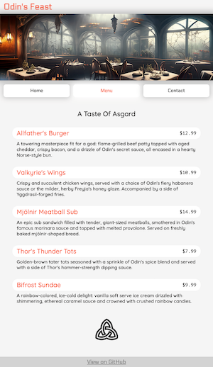

# odin-restaurant

**LIVE DEMO**: https://olzcodes.github.io/odin-restaurant/

The aim of this project was to:

- Create a simple restaurant page with tabbed browsing.
- Use JavaScript DOM manipulation instead of HTML to create the page elements.
- Use Webpack to bundle the JavaScript modules and the other files.

https://www.theodinproject.com/lessons/node-path-javascript-restaurant-page

## Screenshots

Homepage

Menu page

## What I learned from this project

- Splitting JavaScript code into separate modules.
- How to configure and use Webpack for a basic project.
- How to dynamically create DOM elements based on items in an array or object.
